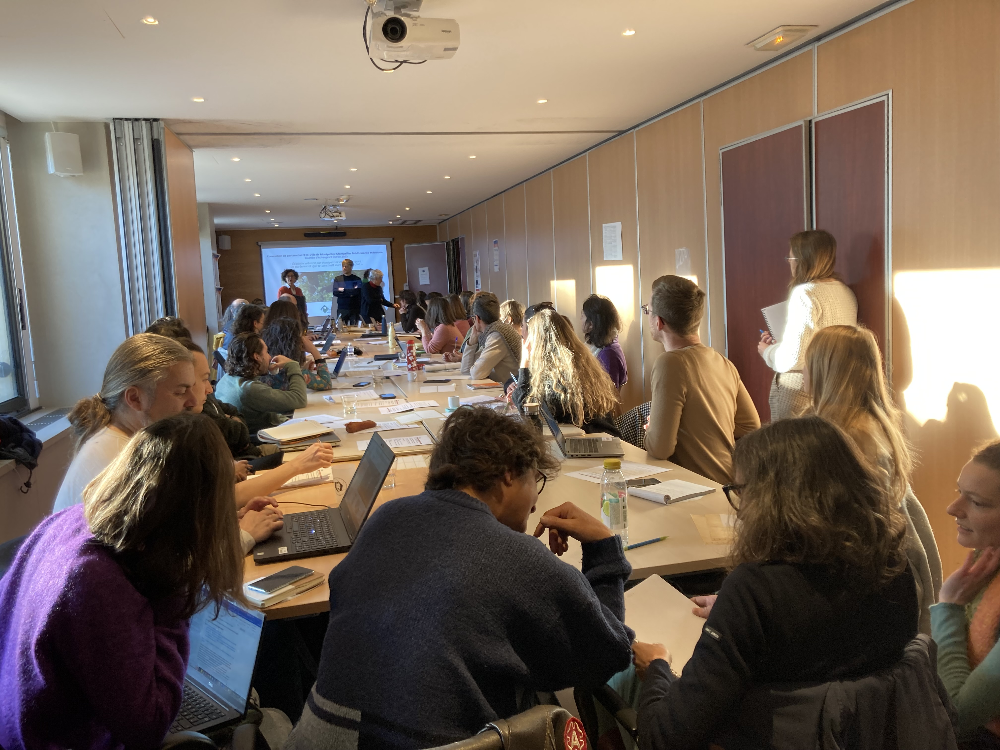

Our lab, the [Centre for Functional and Evolutionary Ecology](https://www.cefe.cnrs.fr/en/) (CEFE), has a long-term collaboration with [Montpellier city](https://www.montpellier.fr/) and [Montpellier Méditerranée Métropole](https://www.montpellier3m.fr/) about urban ecology including issues on connectivity, global change and perceptions of biodiversity. On February 9, a day of exchanges between people from CEFE and Montpellier was organised, and we presented the `OtterConnect` project. We also had several informal exchanges that might lead to new collaborations. More soon hopefully. 

  

