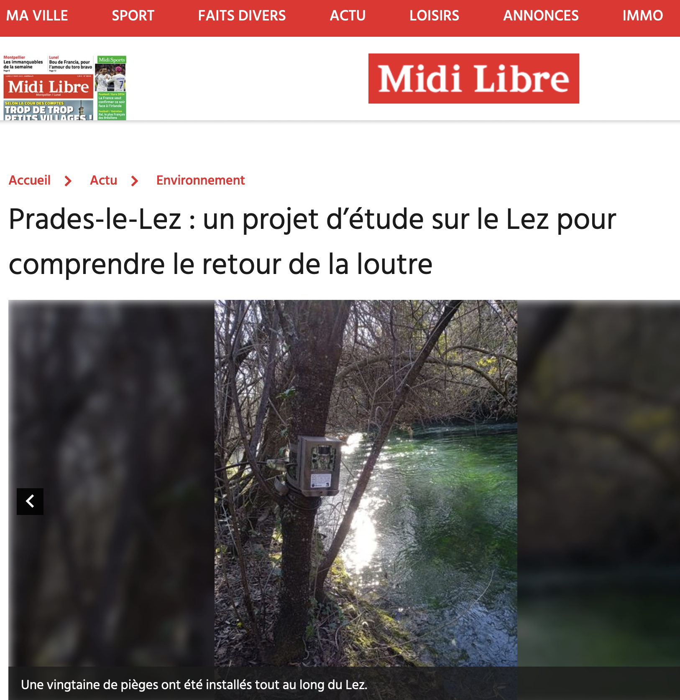

The `OtterConnect` project is in the press! You can read an article in the Midi Libre newspaper at <https://www.midilibre.fr/2023/03/27/un-projet-detude-sur-le-lez-pour-comprendre-le-retour-de-la-loutre-11091062.php>. Thanks to Tristan Bonnet for the interview and the article. 

  

