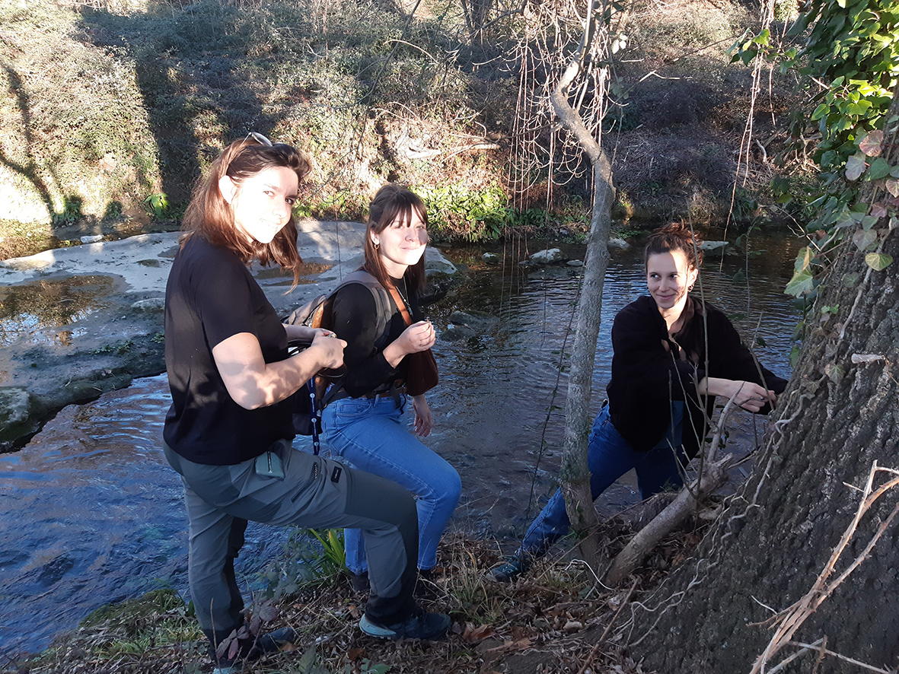

Face à la multiplication d’indices de présence de la loutre d'Europe sur le Bassin de l’Or depuis 2020, le `Symbo` a souhaité se porter partenaire du projet `OtterConnect`. En ce début d'année 2024, différents protocoles de détection de la loutre vont être mis en place sur ce territoire. 

Louise D'Hollande, stagiaire missionnée par le Symbo, avec l'appui de Tatiana Tronel et de Lucie Depinoy de l'association des `Écologistes de l’Euzière`, mais également du `Service Espaces Naturels de Pays de l'Or agglomération`, gestionnaire des terrains du `Conservatoire du littoral` sur les pourtours de l’étang de l’Or, a commencé les prospections pour définir les sites d’échantillonnage : cours d’eau mais aussi marais où plusieurs individus ont été observés.

