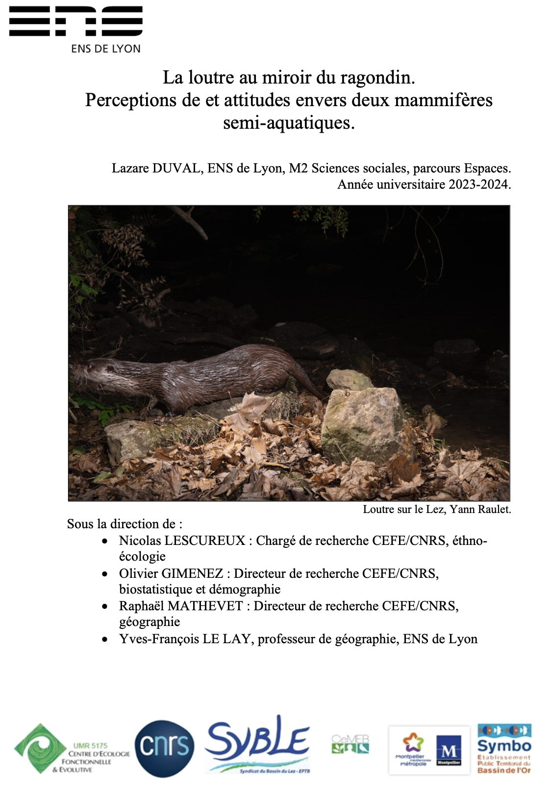

Cette enquête sur les bassins du Lez et de l’Or a permis d’éclairer la perception de la loutre et du ragondin par certains acteurs du territoire. La manière dont ces mammifères sont perçus est en grande partie imputable à leur aspect physique, à la taille de leur population et au milieu dans lequel les enquêtés les imaginent évoluer. À bien des égards, mon enquête révèle que la loutre et le ragondin sont perçus de manière opposée dans la zone d’étude. La loutre évoque le retour du sauvage dans les zones où elle est présente. Certains enquêtés y voient une renaissance des zones humides, après que les activités humaines les aient affaiblies et, littéralement, dénaturées. 

À l’inverse, le ragondin est perçu comme étant en voie d’autochtonisation par plusieurs enquêtés. Son omniprésence dans la zone d’étude et ses capacités d’adaptation aux comportements humains inclinent les enquêtés à le percevoir comme un élément à part entière de la faune endémique du département. Toutefois, ce processus d’autochtonisation n’empêche pas la naissance de plusieurs situations conflictuelles avec les acteurs du territoire. Mon enquête confirme que les comportements animaux peuvent être interprétés comme inappropriés par les humains (Lescureux et al., op. cit.), par une trop grande proximité avec les citadins dans ma zone d’étude. Ce travail confirme également le rôle central de la juste place et du juste nombre dans l’étude de la perception des interactions humains-animaux (Knight, op. cit.), ce qui conduit une partie des enquêtés à considérer la présence du ragondin comme problématique.

Ces deux espèces se sont fait une place dans le milieu. Bien que le ragondin fasse l’objet de campagne de piégeage, son extermination n’est envisagée par aucun de mes enquêtés. Les discours que j’ai recueillis montrent qu’une partie du grand public s’est attachée au ragondin. Certains apprécient son aspect physique, le nourrissent et le considèrent comme un élément de la faune endémique de la région.

La loutre, pourtant endémique de la zone, est revenue dans un milieu différent de celui qu’elle a quitté. L’urbanisation s’est développée, le contexte a changé. La loutre, décrite par les enquêtés au moyen du lexique du sauvage et du lointain, semble en ce sens « exotisée » par les enquêtés. Une large partie d’entre eux la supposent inféodée aux rivières de montagnes et aux espaces de faibles activités humaines. À l’inverse, le ragondin, bien que d’origine exotique, est associé aux espèces endémiques de la zone. Ces perceptions opposées montrent à quel point les comportements des animaux influencent le comportement et les perceptions des humains.

Cette recherche prolonge les travaux qui montrent que les mondes humains et animaux ne sont pas séparés, l’un et l’autre s’influencent en permanence (Ingold, op. cit. ; Brunois, 2005 ; Lescureux, 2006). L’omniprésence du ragondin et le statut de protection de la loutre en font des acteurs politiques du territoire. Les humains tentent de les intégrer dans des stratégies d’enrôlement pour servir leurs intérêts. En retour, ces deux espèces, par leur comportement, s’adaptent et modifient les comportements humains.

Pourtant, mon enquête révèle aussi que nombre d’individus perçoivent la nature comme strictement disjointe du monde des humains. La perception de la loutre comme un « retour du sauvage » ou l’interprétation du comportement du ragondin comme inapproprié en ville en témoignent.

Or, ces visions de la nature ne reflètent pas les agencements faunistiques actuels. S’il apparaît possible de communiquer sur ces deux espèces, il faut garder à l’esprit que les visions préalables des individus conditionneront la manière dont la communication autour de ces animaux sera reçue. Dans ce travail, je propose un mode de communication axée sur l’agentivité animale, pour tenter de sensibiliser le grand public à la manière dont ces animaux s’adaptent aux contingences humaines. La reconnaissance de l’agentivité en conservation est un phénomène assez récent (Edelbutte et al., op. cit.).

La loutre revient dans un milieu largement urbanisé, en se nourrissant en grande partie d’une espèce exotique envahissante. Le ragondin compose avec la présence et les activités des humains dans le milieu. Souligner ces éléments dans la communication qui en sera faite pourrait permettre de déconstruire le mythe d’une nature sauvage séparée des activités humaines.

Il faut également garder à l’esprit que les comportements de ces animaux induisent des possibilités d’attachement différentes pour les humains. L’appréhension sensible et les interactions réciproques sont des leviers importants du développement de l’attachement (Prato- Previde et al., 2022). Or, bien que charismatique, la loutre demeure invisible aux individus non naturalistes et ne disposant pas de l’outillage technique nécessaire à son observation. Au contraire, le ragondin est observable par tout le monde. Une stratégie de communication fondée sur le ragondin pourrait donc être plus pertinente pour sensibiliser le grand public à la protection du milieu à travers une approche fondée sur le rapport sensible aux formes vivantes.
