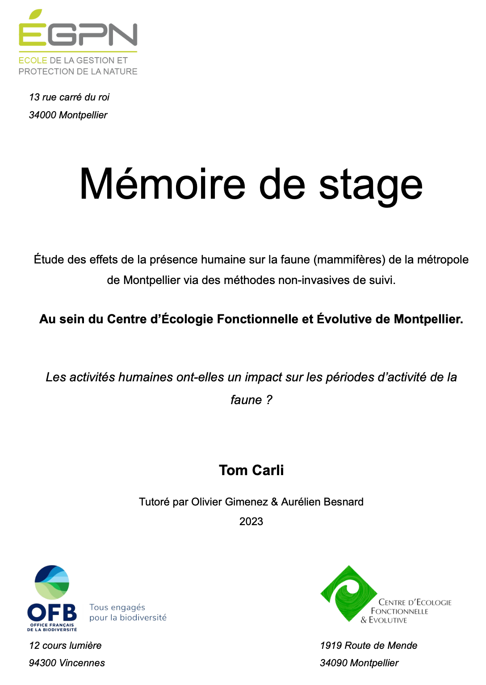

L’augmentation de la population humaine et des ses activités pousse les humains à fréquenter des zones naturelles où parmi elles se trouvent des espèces sensibles.

C'est le cas de la loutre d’Europe qui se retrouve dans Le Lez, un fleuve fréquenté par la population de Montpellier Méditerranée Métropole. Au cours d’une première étude, sa présence a été observée par des épreintes. Il a été décidé de pousser cette recherche en utilisant une méthode non-invasive de suivi à l’aide de pièges photo.

Les résultats obtenus révèlent la présence d’un plus grand nombre d'espèces qu’initialement prévue au début de l’étude. Cela souligne l’importance de préserver la quiétude de ces dernières qui se retrouvent malgré elles à partager leur habitat naturel avec les humains.

