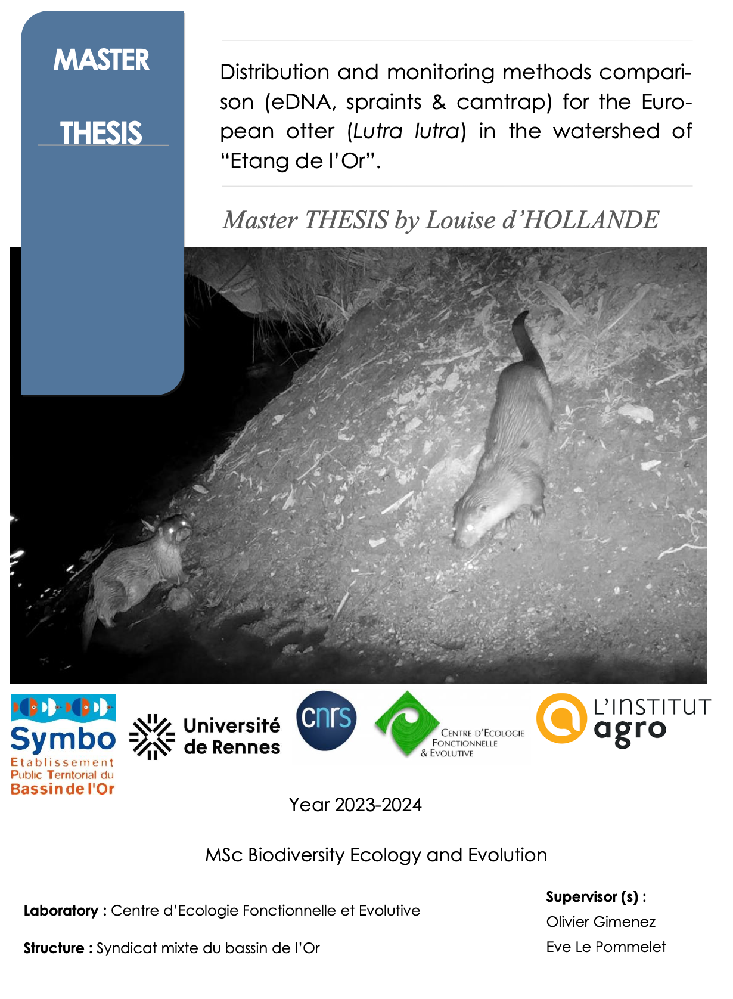

La loutre (Lutra lutra) recolonise différentes régions de France depuis 1971, notamment en Occitanie après une quasi-extinction au siècle dernier. Documenter ce processus de recolonisation est essentiel pour comprendre les facteurs limitants et concevoir des plans de conservation efficaces, tout en approfondissant les connaissances sur l'écologie de cette espèce. Bien que son rétablissement soit observé, les phénomènes à l'origine de ce rétablissement restent mal compris. 

Depuis 2016, les indications de la présence de la loutre dans le bassin de l'Étang de l'Or se sont multipliées, suggérant une recolonisation de ce territoire par cette espèce. Actuellement, la détection de la loutre se fait principalement par le suivi des épreintes. Cependant, cette méthode peut être difficile à mettre en œuvre lorsque le site est difficile d'accès et lorsqu'il ne dispose pas de nombreux endroits propices pour trouver des épreintes (roches, ponts, arbres). 

Ici, nous proposons de mesurer la probabilité de détection de la loutre en utilisant l'outil d'ADN environnemental et de comparer cette méthode avec les suivis classiques des épreintes et des pièges photographiques. Nous avons appliqué les 3 méthodes sur 8 sites en aval du bassin versant. L'analyse multiméthodes a incorporé les données des 3 méthodes, et nous les avons comparées à une méthode unique pour explorer les biais d'occupation associés à chaque méthode et les différences dans la probabilité de détection spécifique à la méthode. 

Les probabilités d'occupation et de détection estimées à partir des analyses d'ADN environnemental se sont révélées biaisées en raison de faux négatifs, provoquant une sous-estimation de la probabilité de détection et d'une surestimation de la probabilité d’occupation. Cette étude suggère que, pour les études nécessitant une détection rapide et fiable, une approche multiméthodes comprenant la détection des épreintes (probabilité de détection > 0,95 avec une enquête à 4 reprises) et des pièges photographiques, semble être le protocole le plus efficace et permet à la fois d’étudier l’état de la population. Cette étude a également permis de créer une carte de répartition de l'espèce à l'aide d'un modèle incluant des données opportunistes et protocolées. La carte montre que l'espèce occupe majoritairement les zones aval du bassin versant, notamment autour des marais. Il existe une tendance à ce que les loutres occupent des plans d’eau contigus, ce qui suggère une préférence pour les habitats connectés.

