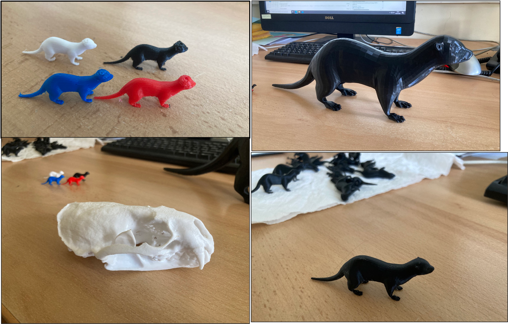

Dans le cadre de nos travaux en médiation scientifique sur la loutre, Caroline Delaire en stage de Master a travaillé avec Pierrick Aury qui a joué les magiciens et imprimé en 3D plusieurs modèles loutres. Le résultat est bluffant! Ces outils seront utilisés dans la valise pédagogique que nous sommes en train de concevoir. 

