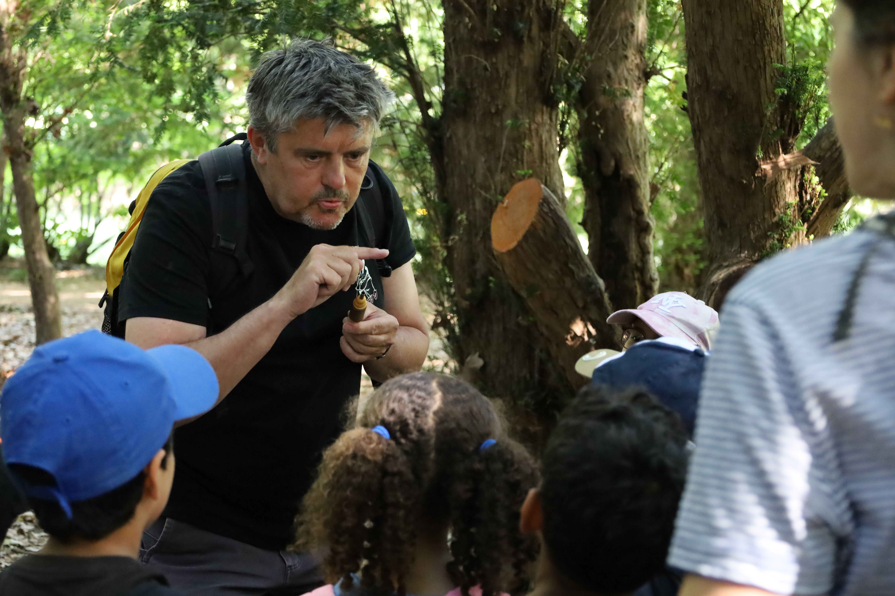
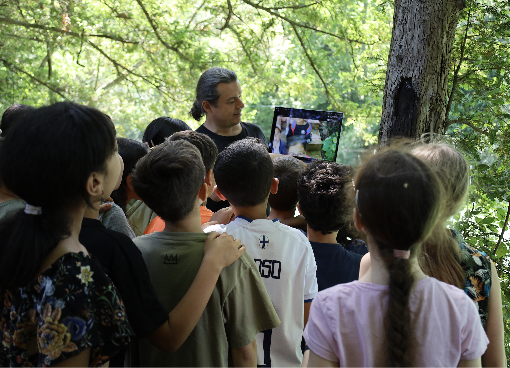

Dans le cadre de nos travaux en médiation scientifique sur la loutre, nous intervenons dans les écoles, ici par exemple avec l'école du Docteur Calmette à Montpellier, avec une classe de CP et une classe de CM2. C'est l'occasion de tester des outils qui seront inclus dans la valise pédagogique que nous sommes en train de concevoir. Dans la première photo on voit Sébastien Ranc du [CPIE APIEU](https://cpie-apieumontpellier.fr/) parler aux oiseaux du Lez avec un appeau, et dans la deuxième Olivier Gimenez qui examine le contenu de la carte SD d'un piège photo sur son ordinateur. Caroline Delaire a co-animé ces sorties avec Sébastien et Olivier, elle est derrière l'appareil photo. 

