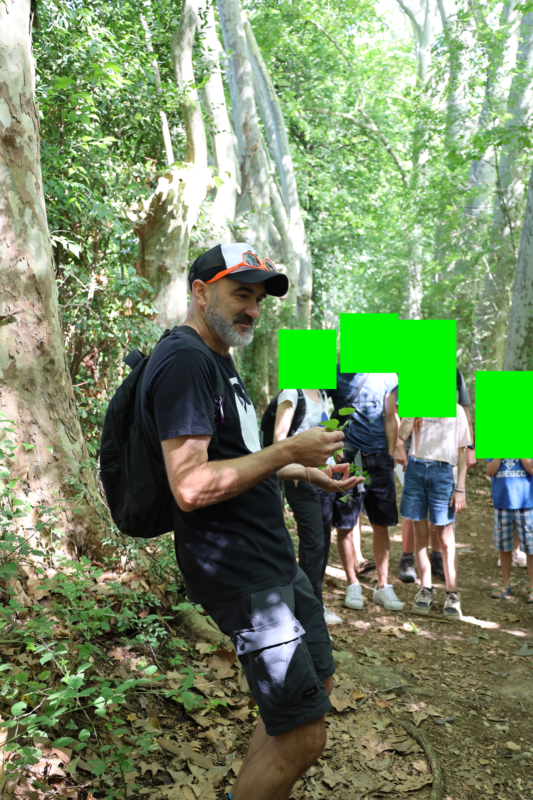
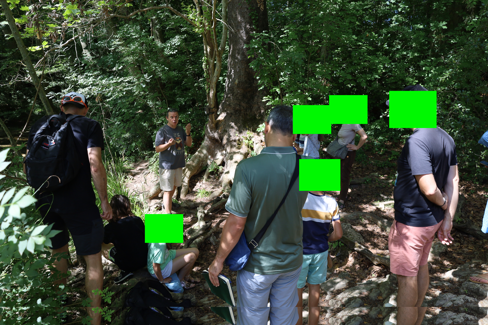
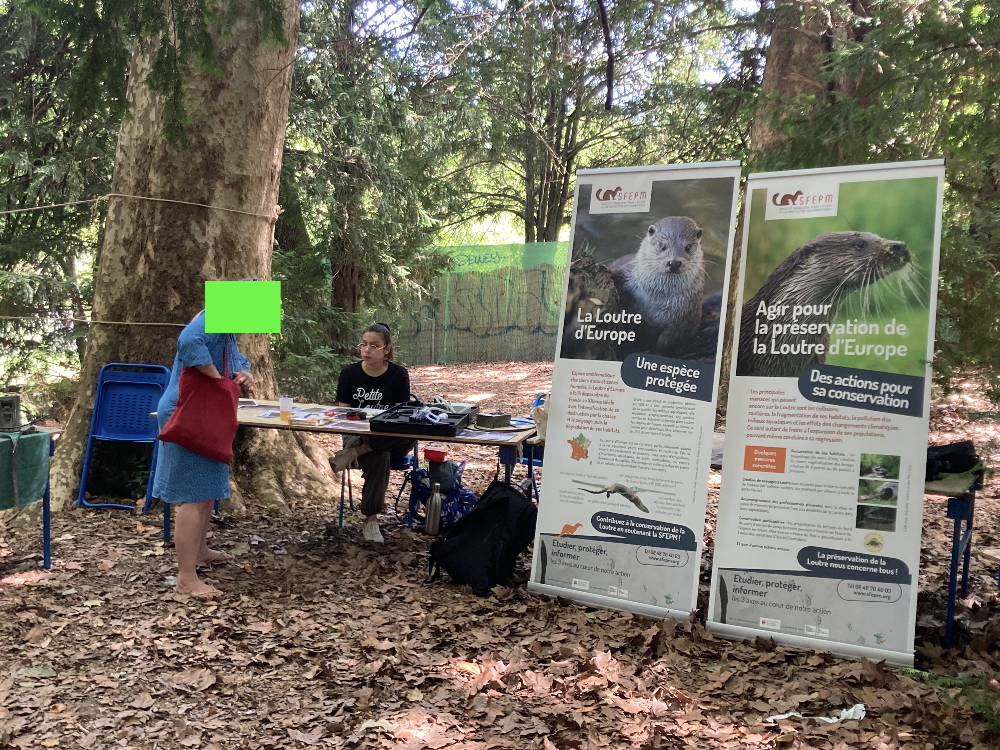

Dans le cadre de nos travaux en médiation scientifique sur la loutre, nous avons participé au [festival Agropol'Eat](https://www.agropoleat-festival.com/) comme ce fut [le cas l'an dernier](https://otterconnect.netlify.app/blog/2023/07/02/agropoleat-festival/). Nous avons organisé une sortie loutre pour le grand public que [Thierry D'Alignan](https://www.linkedin.com/in/canop%C3%A9e-biodiversit%C3%A9-5161a32a8/) a co-animé (au pied levé) avec Olivier Gimenez. Dans la première photo on voit Thierry, dans la deuxième Olivier qui explique le fonctionnement d'un piège photo, et dans la troisième Caroline Delaire qui a animé notre stand avec les collègues de l'[EPTB Lez](https://eptb-lez.fr/). 

