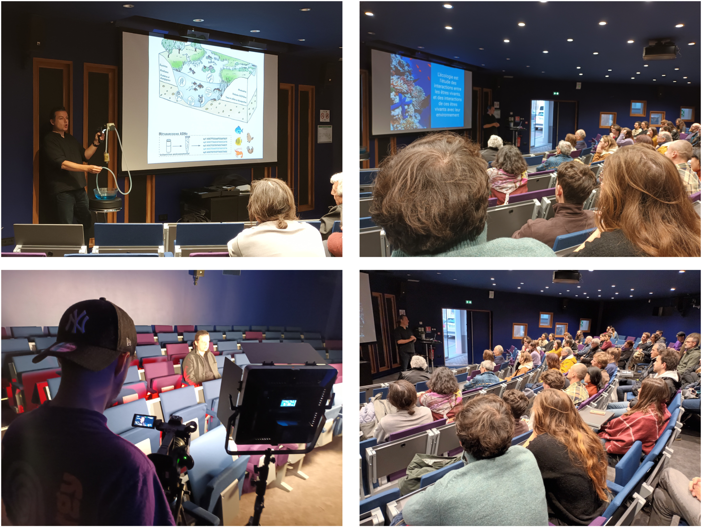

Olivier Gimenez a donné une conférence grand public dans le cadre des 8 jours de la biodiversité organisés par l'inter-assos ARBORESCENCE : « Au fil de l’eau du Lez : à la  découverte de la loutre d’Europe sur la métropole de Montpellier ». Vous pouvez retrouver le diaporama ainsi que quelques photos ci-dessous.  

<iframe src="https://widgets.figshare.com/articles/26297149/embed?show_title=1" width="568" height="351" allowfullscreen frameborder="0"></iframe>

