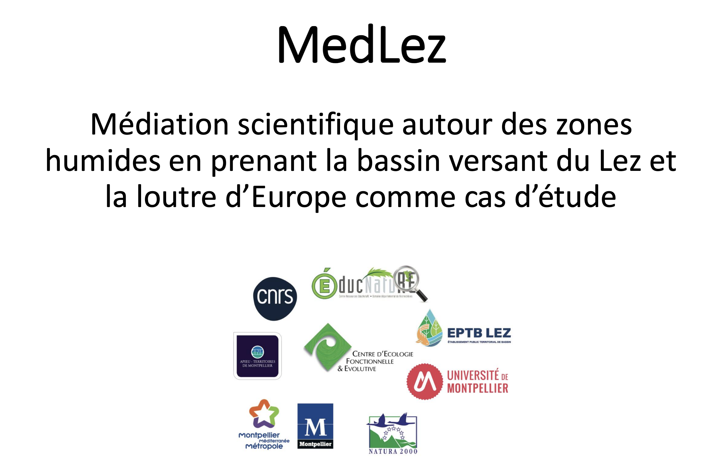

Nos travaux sur la loutre d'Europe se sont étoffés d'un programme de médiation scientifique grâce au soutien du [Labex Cemeb](https://www.labex-cemeb.org/) et de la [GEMAPI](https://www.montpellier.fr/actions/competences/sante-environnementale/cycles-de-leau/milieux-aquatiques-et-inondations) de Montpellier Méditerranée Métropole. 
Nous proposons une exposition photo illustrant la diversé de la faune et de la flore du Lez, ainsi qu'une valise pédagogique. Vous trouverez plus de détails dans ces questions diapos [ici](https://oliviergimenez.github.io/prez/prez-medlez.pdf). 

