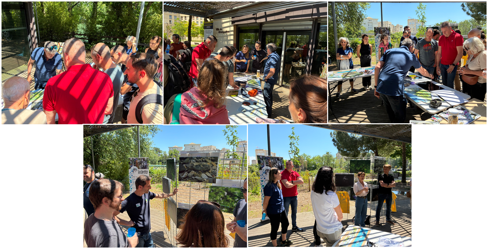

Nous avons inauguré la valise pédagogique MEDLEZ et en avons profité pour exposer quelques photos. L'événement a été organisé par Juliette Picot du service Gestion des Milieux Aquatiques et Prévention des Inondations (GEMAPI) de la métropole de Montpellier. L'occasion de présenter nos travaux aux élu.e.s et au public. 
C'est aussi avec grand plaisir que avons pu découvrir le sentier botanique élaboré par nos collègues du club [Montpellier Canoë Kayak](Montpellier Canoe-Kayak). 

