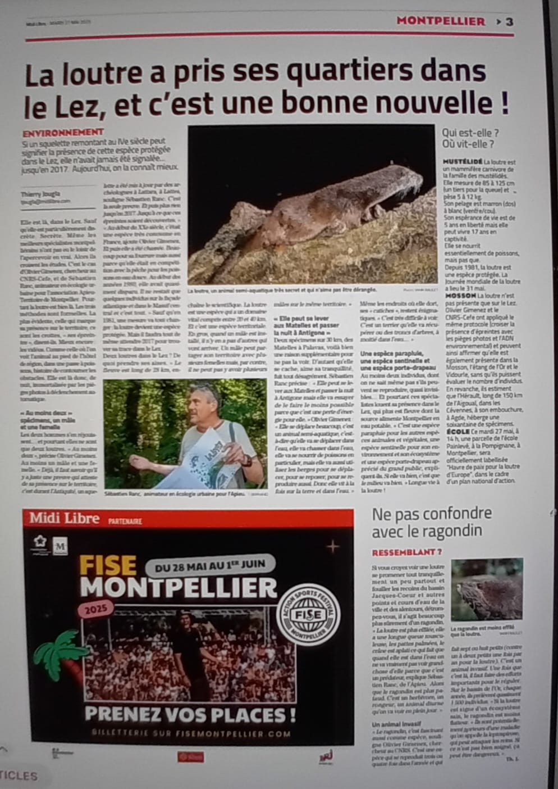

Sébastien Ranc et Olivier Gimenez ont été interviewés par Thierry Jougla du Midi Libre. Lisez l'article en ligne [ici](https://www.midilibre.fr/2025/05/23/elle-peut-se-lever-aux-matelles-et-passer-la-nuit-a-antigone-la-loutre-a-pris-ses-quartiers-dans-le-lez-a-montpellier-et-cest-une-tres-bonne-nouvelle-12714387.php) et [ici](https://www.midilibre.fr/2025/05/26/loutre-ou-ragondin-ca-na-rien-a-voir-ne-confondez-surtout-pas-lanimal-que-vous-avez-apercu-les-pieds-dans-leau-a-montpellier-12714430.php) ou bien directement là : 

