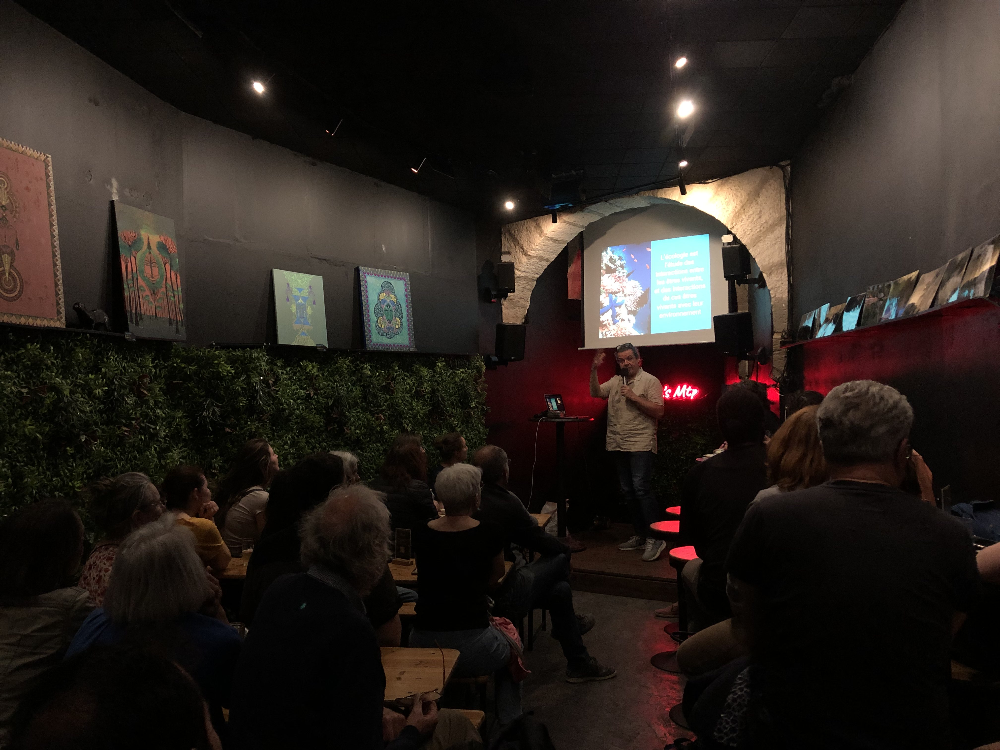

Olivier Gimenez a participé à l'événement Pint of Science. Il a parlé des travaux de l'équipe sur la loutre, dans une soirée intitulée "Faune urbaine, nos voisins à plumes et à poils". 
La présentation est disponible [ici](https://doi.org/10.6084/m9.figshare.29603153.v1). Plus d'informations sur l'événement [là](https://pintofscience.fr/event/faune-urbaine-nos-voisins-a-plumes-et-a-poils). 

