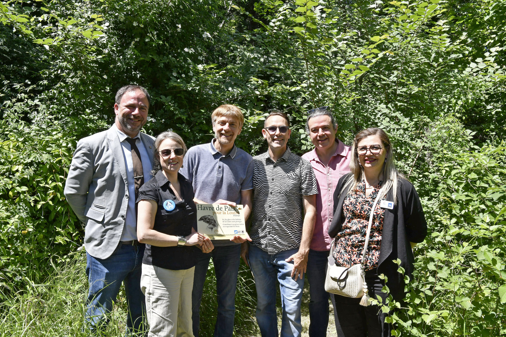
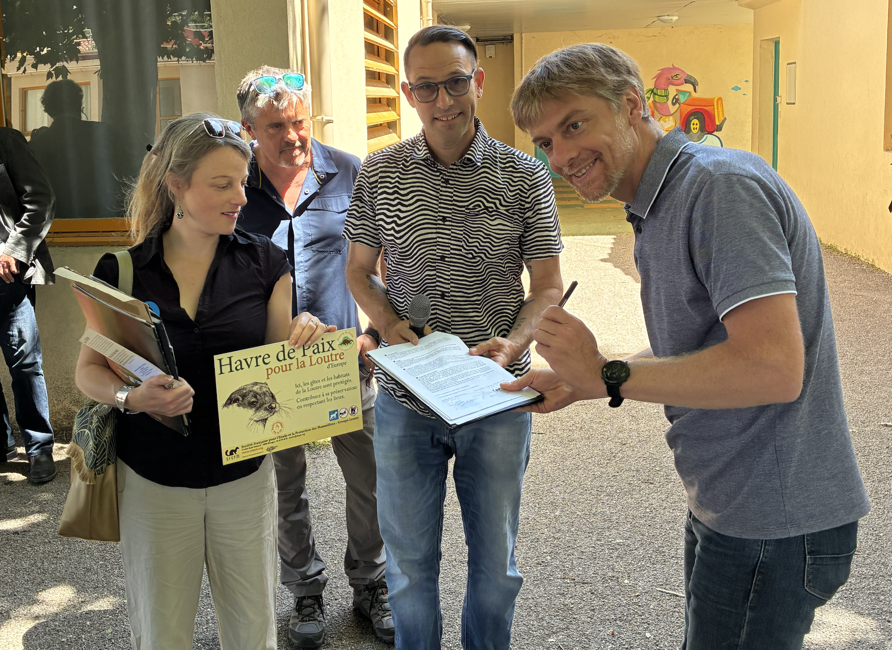
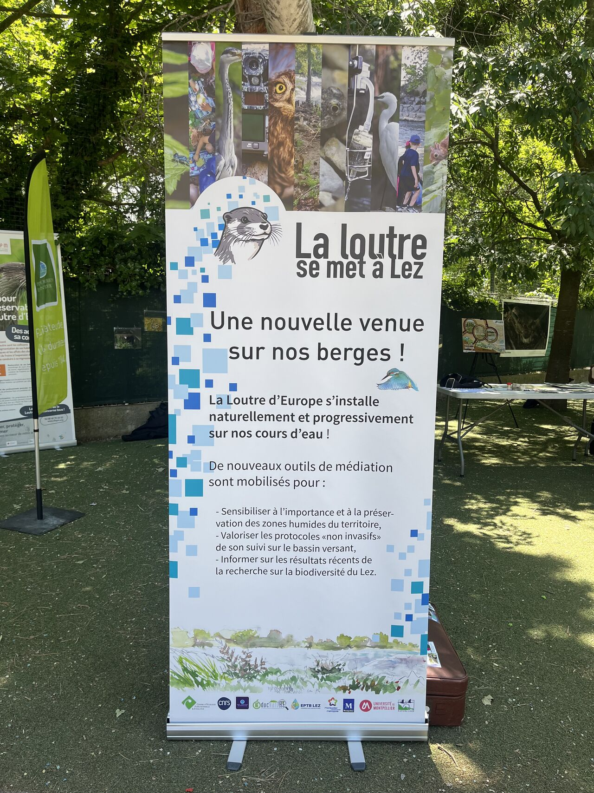

Sous la houlette de Yann Raulet, un havre de paix pour la loutre a été inauguré le 27 mai à Montpellier à l'école Painlevé. La parcelle concernée est aussi une Aire Terrestre Educative animée par Sébastien Ranc. L’opération Havre de Paix pour la Loutre d’Europe est une action de conservation participative. Elle permet à tout propriétaire, privé ou public, de parcelle traversée ou bordée par un cours d'eau, un plan d'eau ou une zone humide, d’agir concrètement pour la protection de la Loutre en créant chez lui un espace privilégié pour cette espèce et s’il le souhaite, en communiquant sur son engagement grâce à des autocollants et à des panneaux qui permettront d’informer voisins, amis et passants. Pour en savoir plus sur l'opération, rendez-vous [ici](https://www.sfepm.org/loperation-havre-de-paix-pour-la-loutre-deurope.html). 

<figure>
  
  <figcaption>(De gauche à droite) Jérôme Moynier, Camille Fraissard, Stéphane Jouault, Yann Raulet, Olivier Gimenez, et Emilie Cabello, mardi 27 mai lors de la remise du Label  <em>havre de paix de la Loutre d'Europe</em> dans le quartier de la Pompignane.  Crédit : Cécile Marson / Montpellier Ville et Métropole.</figcaption>
</figure>

<figure>
  
  <figcaption>(De gauche à droite) Camille Fraissard, Sébastien Ranc, Yann Raulet et Stéphane Jouault, mardi 27 mai lors de la signature du Label  <em>havre de paix de la Loutre d'Europe</em> dans le quartier de la Pompignane.  Crédit : Olivier Gimenez / CNRS.</figcaption>
</figure>

<figure>
  
  <figcaption>Le kakémono du projet de médiation scientifique MedLez ou la loutre se met à Lez.  Crédit : Olivier Gimenez / CNRS.</figcaption>
</figure>
