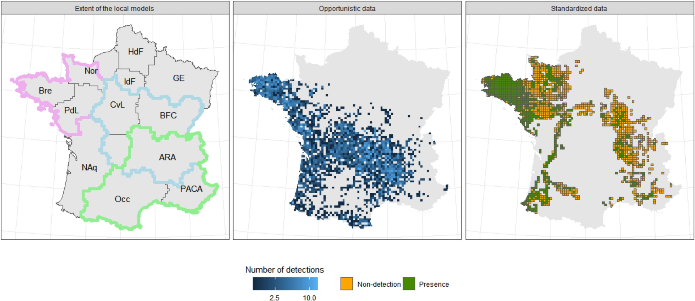

Dans le cadre de son travail de thèse, Simon Lacombe vient de publier son premier article scientifique qui document le retour spectaculaire de la loutre d'Europe en France. 
Après avoir frôlé l’extinction au cours du XXe siècle, la loutre d’Europe (Lutra lutra) reconquiert peu à peu les rivières françaises. 
Grâce à un important travail de collecte et de modélisation de données mené par notre équipe, une carte inédite de l’expansion de l’espèce sur les quinze dernières années vient d’être établie. 
Cette étude, parue dans la revue Biological Conservation, révèle non seulement une progression régulière de la loutre sur le territoire national, mais aussi la reconnexion de noyaux de population historiquement isolés. 
Une bonne nouvelle pour ce petit carnivore charismatique, discret, et aujourd’hui encore menacé. L'article est consultable [ici](https://www.sciencedirect.com/science/article/pii/S0006320725002162#f0005) en anglais. 

<figure>
  
  <figcaption>Carte de la zone d'étude et données collectées entre 2009 et 2023 par les 24 structures partenaires du projet. 
  Le panneau de gauche montre l'étendue des trois modèles avec des lignes de couleur en gras (rose : nord-ouest, bleu : centre, vert : sud-est) ainsi que les contours des régions administratives avec des lignes noires fines. 
  Les régions administratives sont nommées avec les abréviations utilisées dans le texte principal de l'article. 
  Le panneau du milieu montre le nombre d'observations opportunistes par cellule pour l'ensemble de la période d'étude après sous-échantillonnage.
  Le panneau de droite montre le résultat des échantillonnages standardisées, une cellule étant notée comme « présent » si au moins une visite a été positive entre 2009 et 2023.</figcaption>
</figure>
