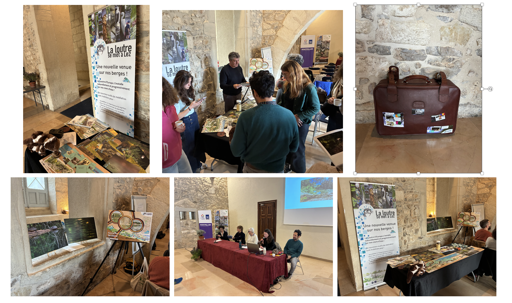

Dans le cadre de nos travaux en médiation scientifique sur la loutre, nous avons présenté le projet MedLez dans lequel nous avons développé une mallette pédagogique et conçu une exposition photographique. La présentation est disponible [ici](https://doi.org/10.6084/m9.figshare.29603252.v1).

