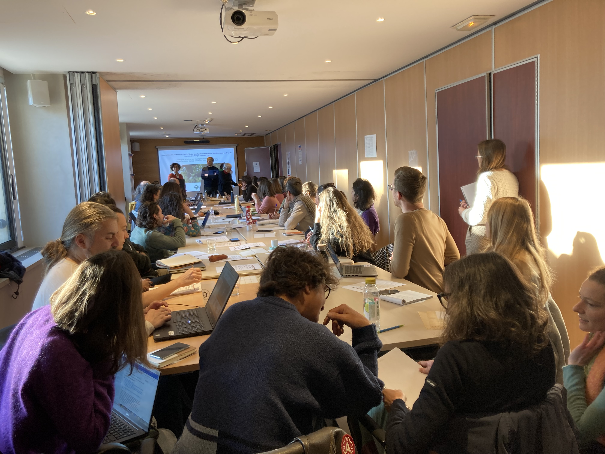

Notre laboratoire, le [Centre d'Ecologie Fonctionnelle et Evolutive](https://www.cefe.cnrs.fr/) (CEFE), entretient une collaboration de longue date avec [la ville de Montpellier](https://www.montpellier.fr/) et [Montpellier Méditerranée Métropole](https://www.montpellier3m.fr/) dans le domaine de l'écologie urbaine, notamment sur les questions de connectivité, des changements globaux et des perceptions de la biodiversité. Le 9 février, une journée d'échanges entre des personnes du CEFE et de la ville/métropole de Montpellier a été organisée, et nous avons présenté le projet `OtterConnect`. Nous avons également eu plusieurs échanges informels qui pourraient déboucher sur de nouvelles collaborations. Plus d'informations bientôt, nous l'espérons. 

  

