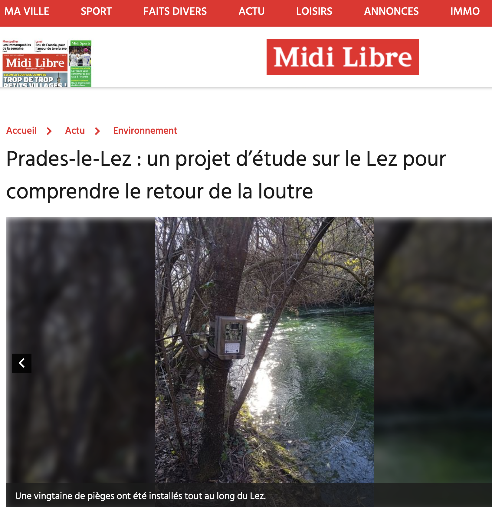

On parle du projet `OtterConnect` dans la presse ! Vous pouvez lire un article dans le Midi Libre sur <https://www.midilibre.fr/2023/03/27/un-projet-detude-sur-le-lez-pour-comprendre-le-retour-de-la-loutre-11091062.php>. Merci à Tristan Bonnet pour l'entretien et l'article. 

  

